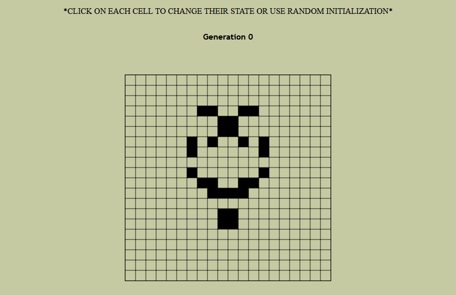

# Conway's Game Of Life in JavaScript

This is a simple implementation of Conway's Game of Life in JavaScript. 

I hope you enjoy it 🙂

Demo: https://farzadex-eth.github.io/js-game-of-life/

-------
## _Update 1_

- There was a problem in next generation logic and it's fixed now
- Reset Button resets the board 
- You can click on each cell and change its state, or you can use Random button to create randomized cells
- A little optimization: only changed cells are drawn each generation